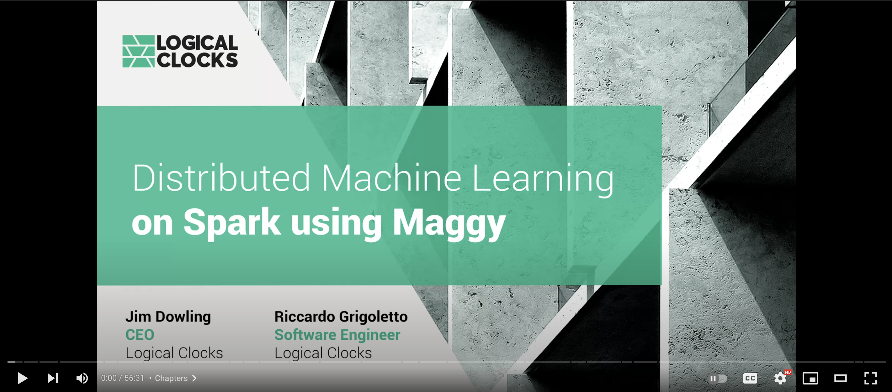

# Introduction

Distributed training is useful for big models that can't fit in a single machine and for very big datasets.
There are several techniques available. As an example, the Mirrored Strategies replicate the models over the workers and 
train them using splits of the data. 

With Maggy, you can train a Machine Learning model in a distributed fashion without rewriting the code of the training.
Distributed Training with Maggy is available on TensorFlow and PyTorch.

If you want to know more on how to use Maggy for Distributed Training, you can watch the presentation in the next section.

When you are ready, you can inspect an example on [TensorFlow](tensorflow.md) or [PyTorch](torch.md).

## Maggy Distributed Model Training

