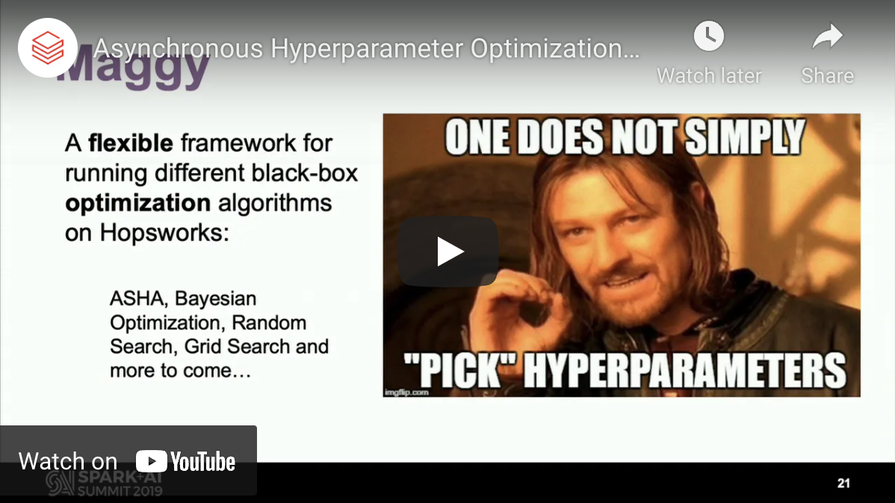

# Introduction

Maggy is a framework for asynchronous trials and early-stopping with global knowledge, guided by an Optimizer. 
Developers can use an existing Optimizer, such as asynchronous successive halving (ASHA), or provide their own one. 
The basic approach we followed was to add support for the Driver and Executors to communicate via RPCs. 
The Optimizer that guides hyperparameter search is located on the Driver, and it assigns trials to Executors. 
Executors periodically send back to the Driver the current performance of their trial, 
and the Optimizer can decide to early-stop its ongoing trial, followed by sending the Executor with a new trial. 
Because of the impedance mismatch between trials and the stage-/task-based execution model of Spark, 
we are blocking Executors with long-running tasks to run multiple trials per task. 
In this way, Executors are always kept busy running trials, and global information needed for efficient 
early-stopping is aggregated in the Optimizer.
If you want to know more about Maggy for HPO, you can watch the presentation in the video posted below.
Otherwise, if you feel ready to explore more details, you can jump to the [strategies](strategies.md) section.

## Spark/AI summit presentation of Maggy for HPO

