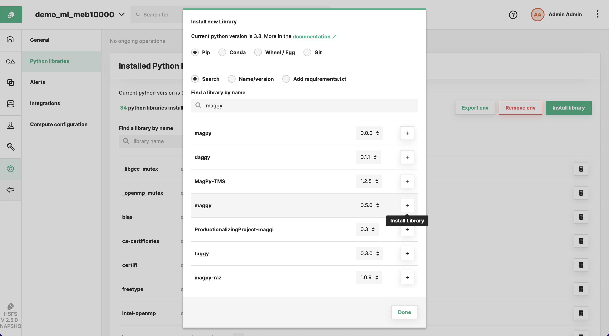

# Installing Maggy in your laptop

Maggy is available via pip.

Simply run the following commnad in your terminal or conda environment. 

```
pip install maggy
```

If you want to use another version of Maggy, you can run the following command.

```
pip install maggy==x.y.z
```

The available versions are listed in PyPi https://pypi.org/project/maggy/ .

# Installing Maggy in Hopsworks

If you are using Hopsworks, Maggy should be already installed and ready to be used.

However, it is possible to check the installation from the platform by entering a project,
then navigate to the "Python" section from the sidebar and click on "Manage Environment"
on the top bar. Finally, search for "Maggy".

If you want to change the version of Maggy, click on "Install" in the top bar and type "Maggy"
on the search input. Finally, select the version you want to install and click.
The progress of the installation is displayed in the "Ongoing Operations" section.




# Installing Maggy in Databricks


It is very simple to install Maggy in your Databricks cluster. 
From your project, click on Libraries in the navigation bar and Install New, at this point it is possible to install 
the latest release of Maggy in the PyPi section. In order to do that, just write "maggy" in the Package input section.

You can install other version of Maggy by uploading the wheel on the Upload section.


